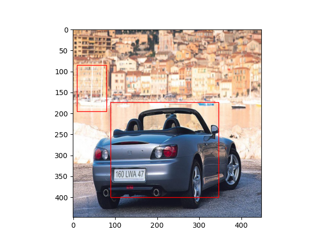
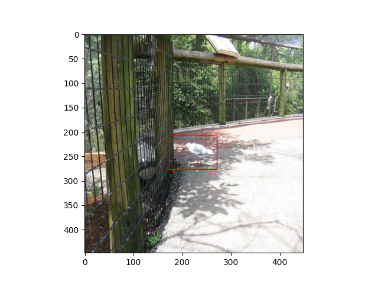

### Implement YOLOv1 from scratch

#### Prediction Result

    
    
    

not pretty good! 🤔

#### Dataset: PascalVOC_YOLO

[Download Dataset here](https://www.kaggle.com/dataset/734b7bcb7ef13a045cbdd007a3c19874c2586ed0b02b4afc86126e89d00af8d2)

